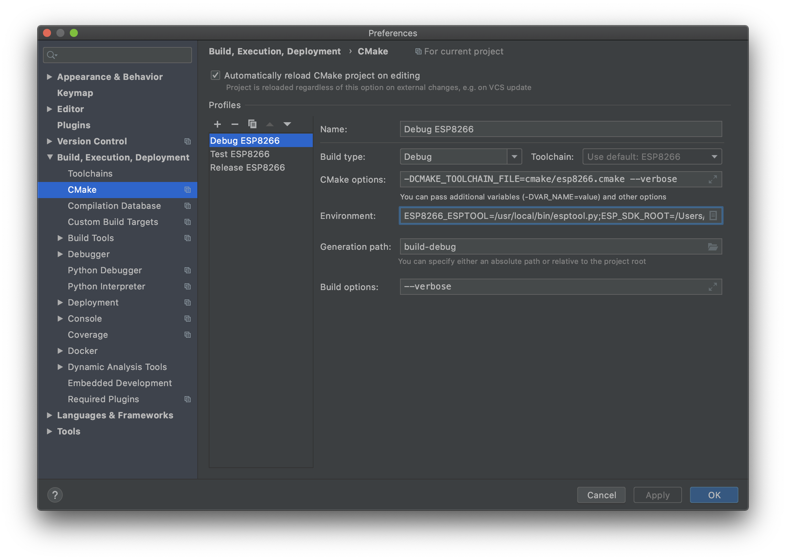
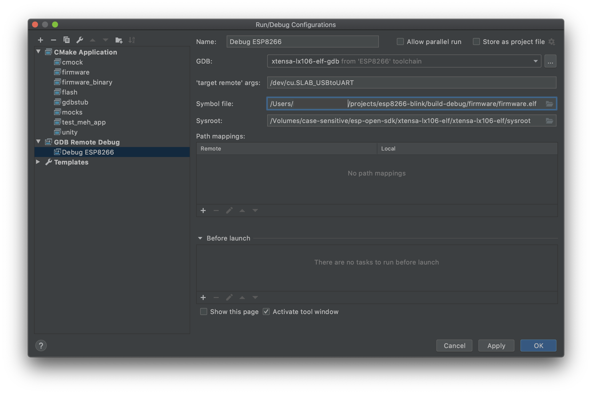

# Building and debugging ESP8266 firmware on Mac OS Catalina using CMake, CLion and GDB

This is a simple demonstration of building and debugging firmware for an 
ESP8266 NodeMCU module on Mac OS Catalina using CLion.

## Prerequisites

This guide assumes you have XCode 11.4 and CLion 2019.3 installed.

You will also need the Silicon labs CP2102 USB to UART driver. This will allow your machine to
communicate with the module over the USB port.

https://www.silabs.com/products/development-tools/software/usb-to-uart-bridge-vcp-drivers

## Building ESP Open SDK

You will first need to follow the Mac OS-specific instructions from https://github.com/pfalcon/esp-open-sdk 
as follows:

Install dependencies using Homebrew:

```shell script
brew tap homebrew/dupes
brew install binutils coreutils automake wget gawk libtool help2man gperf gnu-sed --with-default-names grep
export PATH="/usr/local/opt/gnu-sed/libexec/gnubin:$PATH"
```

Assuming your default file system is not case-sensitive, you will need to
create and mount a case-sensitive drive, and then recursively clone
the repo from this drive.

```shell script
sudo hdiutil create ~/Documents/case-sensitive.dmg -volname "case-sensitive" -size 10g -fs "Case-sensitive HFS+"
sudo hdiutil mount ~/Documents/case-sensitive.dmg
cd /Volumes/case-sensitive
git clone --recursive https://github.com/pfalcon/esp-open-sdk.git
cd esp-open-sdk
```

Apply various fixes from the internet:

* Tweak crosstool-NG/configure.ac to allow Bash versions greater than 3 (if you have Bash 4 or above 
on your system - Mac OS normally ships with an ancient version of Bash so this
is not necessarily a problem)

Change line 193 to:

```
                     |$EGREP '^GNU bash, version (3\.[1-9]|[4-9])')
```

* Fix non-standard use of Sed in Makefile:

Add on line 23:

```makefile
SED = /usr/local/bin/sed
```

Then update all references to sed with ${SED} on lines 102, 103, 137 and 138

* Do this https://github.com/pfalcon/esp-open-sdk/issues/342#issuecomment-449662238

On line 51-52 of crosstool-NG/kconfig/Makefile,

```makefile
$(nconf_OBJ) $(nconf_DEP): CFLAGS += $(INTL_CFLAGS) -I/usr/local/Cellar/ncurses/6.2/include
nconf: LDFLAGS += -lmenu -lpanel $(LIBS) -L/usr/local/Cellar/ncurses/6.2/lib
```

Finally run the make command to create a standalone SDK:

```shell script
make
```

If successful, you should get a message like the following:

```
Xtensa toolchain is built, to use it:

export PATH=/Volumes/case-sensitive/esp-open-sdk/xtensa-lx106-elf/bin:$PATH

Espressif ESP8266 SDK is installed, its libraries and headers are merged with the toolchain
```

Once the SDK has been built successfully, set ESP_SDK_ROOT and PATH update 
your path in ~/.zshenv as follows:

```
echo export ESP_SDK_ROOT=/Volumes/case-sensitive/esp-open-sdk >> ~/.zshenv
echo export PATH=${ESP_SDK_ROOT}/xtensa-lx106-elf/bin:$PATH >> ~/.zshenv
source ~/.zshenv
```

## Building on the command line

CMake is an open-source, cross-platform family of tools designed to build, test and package software.
It standardises the way builds and their dependencies are specified and avoids the need to create crazy custom Makefiles 
that no one understands. CMake creates a standardised Makefile as part of its initial meta-build step.

If building from the command line, you will need to have CMake installed. You
can use brew for this:

```shell script
brew install cmake
```

When running CMake, it's a good idea to do it within a dedicated build directory. This
is because CMake likes to create a lot of build files scattered deep within your directory structure. If executed within 
a build directory, all these files will be contained and more easily deleted.

```shell script
mkdir -p build
cd build
rm -rf *
cmake .. --verbose
```

## Flashing from the command line

Obviously you will need the ESP8266 module connected to a USB port for this to work.

```shell script
cmake --build . --verbose --target flash
```

The above assumes the USB device will be available at /dev/cu.SLAB_USBtoUART

## Building using CLion

To use the CLion to build, you will need to set up a Toolchain and CMake profile.


The above paths to the esp-open-sdk installation will need setting to the correct ones
for your installation.

Be sure to specify the xtensa-lx106-elf-gcc command for both the C and C++ compiler, and 
xtensa-lx106-elf-gdb for the debugger. The CMake version can be kept as the
bundled one.



The CMake profile needs the Toolchain specifying (the one just created)
and set the generation path to be build. Optionally set --verbose
as a build option.

## Debugging prerequisites

The configuration for GDB is held in the .gdbinit file. In order for GDB to use this file
it's necessary to configure your local ~/.gdbinit file to allow this:

```shell script
echo set auto-load safe-path ~/projects/esp8266-blink >> ~/.gdbinit
```

More information on the security implications of the above are found here:

https://sourceware.org/gdb/onlinedocs/gdb/Auto_002dloading-safe-path.html

## Debugging from CLion

It took quite a lot of time to get CLion debugging working with GDB. Frequently the debugger
would terminate leaving the icons grayed out or it would report some internal error.

Key learnings were:

* All breakpoints set in the IDE need to be muted or deleted on startup
* Break on init needs to be set to 1 in gdbstub-cfg.h
* It's often necessary to reset the board before starting the debugger
* The ~/.gdbinit file needs creating and setting to enable the project .gdbinit file
* The project .gdbinit file must not contain any set target remote commands
as these interfere with the IDE's interaction with GDB. It results in a 'Cannot configure GDB defaults: Cannot change this setting while the inferior is running.'
error.
* A hookpost-remote needs to be set in the .gdbinit to manually set a (hardware)
breakpoint somewhere in the code. This breakpoint needs to be somewhere that will
not interfere with debugging as it is not removable by the IDE.

Create a debug configuration from Run | Edit Configurations:



Reset the board.

Run the debug configuration:


## Debugging from the command line

When debugging from the command line it's necessary to uncomment lines 8 and 9 of .gdbinit where
indicated.

Then reset the board.

```shell script
xtensa-lx106-elf-gdb -x gdbstub/gdbcmds
```

You should see something similar to:

```gdb
GNU gdb (crosstool-NG crosstool-ng-1.22.0-60-g37b07f6f-dirty) 7.10
Copyright (C) 2015 Free Software Foundation, Inc.
License GPLv3+: GNU GPL version 3 or later <http://gnu.org/licenses/gpl.html>
This is free software: you are free to change and redistribute it.
There is NO WARRANTY, to the extent permitted by law.  Type "show copying"
and "show warranty" for details.
This GDB was configured as "--host=x86_64-build_apple-darwin19.3.0 --target=xtensa-lx106-elf".
Type "show configuration" for configuration details.
For bug reporting instructions, please see:
<http://www.gnu.org/software/gdb/bugs/>.
Find the GDB manual and other documentation resources online at:
<http://www.gnu.org/software/gdb/documentation/>.
For help, type "help".
Type "apropos word" to search for commands related to "word".
Reading symbols from build/firmware.elf...done.
Reading in symbols for ~/projects/esp8266-blink/gdbstub/gdbstub-entry.S...done.
gdbstub_do_break_breakpoint_addr () at ~/projects/esp8266-blink/gdbstub/gdbstub-entry.S:399
399		break 0,0
Reading in symbols for ~/projects/esp8266-blink/user/main.c...done.
Breakpoint 1 at 0x4010009c: file ~/projects/esp8266-blink/user/main.c, line 13.
Current language:  auto
The current source language is "auto; currently asm".
(gdb) 
```

Enter c and you should see:

```gdb
Continuing.
mode : 

Breakpoint 1, some_timerfunc (arg=0x0) at ~/projects/esp8266-blink/user/main.c:13
13	{
Current language:  auto
The current source language is "auto; currently c".
(gdb) 
```

Then enter 'layout next':

```gdb
(gdb) layout next

   ┌──~/projects/esp8266-blink/user/main.c──────────────────────────────────────────────────────────────────────────┐
   │8       // for other boards.                                                                                                        │
   │9       static const int pin = 2;                                                                                                   │
   │10      static os_timer_t some_timer;                                                                                               │
   │11                                                                                                                                  │
   │12      void some_timerfunc(void *arg)                                                                                              │
B+ │13      {                                                                                                                           │
   │14          static int my_var = 0;                                                                                                  │
   │15                                                                                                                                  │
   │16          //Do blinky stuff                                                                                                       │
  >│17          if (GPIO_REG_READ(GPIO_OUT_ADDRESS) & (1 << pin))                                                                       │
   │18          {                                                                                                                       │
   │19              my_var++;                                                                                                           │
   │20              // set gpio low                                                                                                     │
   └────────────────────────────────────────────────────────────────────────────────────────────────────────────────────────────────────┘
remote Thread <main> In: some_timerfunc                                                                             L17   PC: 0x401000a1 
(gdb) 
```

You can then enter n multiple times to step through the code.

A good tutorial on GDB can be found here https://youtu.be/bWH-nL7v5F4
